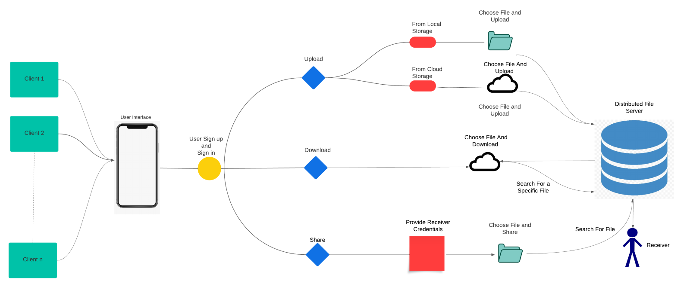
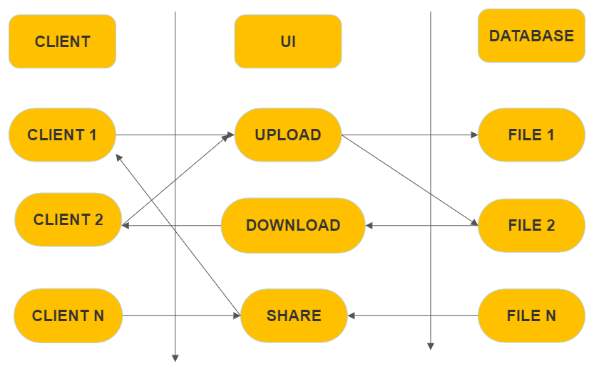
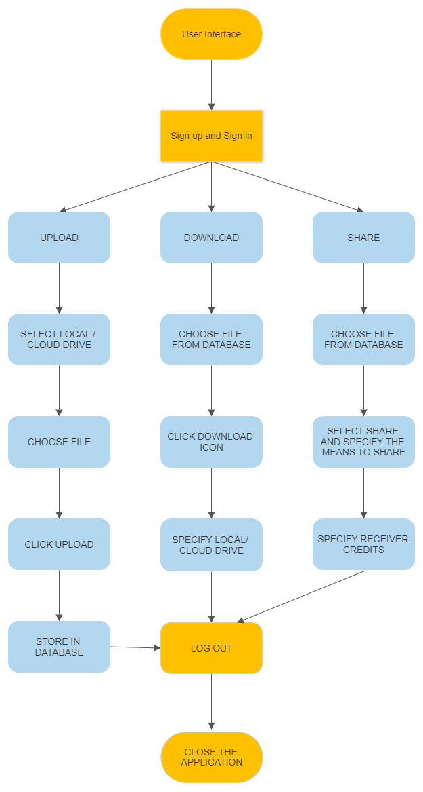

# INTRODUCTION

A High-Level Design (HLD) is a technical document for a (generally) non-technical audience. A High-level Design aims to provide all relevant stakeholders with a bird’s eye view of the solution architecture and design after implementation (or integration).

# SYSTEM ARCHITECTURE

The image is a system architecture diagram that illustrates how a distributed file sharing system works. A file sharing system is a way of transferring files between different devices over a network, such as the internet. 

The architecture has four main components: the client, the server, the file, and the recipient. 

- The client is the device that uploads the file to the server. 

- The server is the device that stores the file and makes it available for download. 
- The file is the data being transferred. 
- The recipient is the device that downloads the file from the server. 

The architecture shows six steps in the process of uploading, downloading, and sharing files. They are: 

- The client chooses a file to upload from their device. 

- The client sends a request to the server to upload the file. 

- The server accepts the request and allocates space for the file. 

- The client uploads the file to the server. 

- The server assigns a unique identifier to the file and sends it back to the client. 

- The client shares the identifier with the recipient. 

The architecture also shows four steps in the process of searching and downloading files. They are: 

- The recipient searches for the file on the server using the identifier. 

- The server verifies the identifier and locates the file. 

- The server sends a response to the recipient with the file information. 

- The recipient downloads the file from the server.  

# DATA DESIGN: 

- There can be N number of users who can access the UI by signing up. 

- The user can store any file. The storage for a single user is limited to 100GB.  

- The files have access controls specified by the owner.  

- When a user uploads a file, a directive is created to the user specifically where he can access his uploaded files.  

- The files shared by other users will be available in the Shared files section.  

- The user has the right to specify what the other users can do with their files (read-only, read-write). Files are saved as specified by the uploader.  

- The downloaded file will still be available in the storage until the uploader or anyone with access decides to delete it.  

- The shared files will be available in all the collaborators' storage. 

- The files metadata will be saved. 

- The uploaded, edited time along with date and file size will be mentioned. 
 

# INTERFACE DESIGN:  

Client interacts with the UI. The User can upload, download, and share once they log in. The UI interacts with the database. The UI is connected to the database once the user logs in. 

## Upload 

User click upload in the UI and specifies the file to be uploaded. Then uploads it. The uploaded file is stored in the database.  

## Download

User clicks download in the UI and selects the file to download. The file is retrieved from the database and is downloaded in the specified location. 

## Share

Select the file to be shared and the way to share it. The Database retrieves the file and sends it to the selected user. 

The user can log out and log in whenever necessary. 

# PROCEDURAL DESIGN    

## Sign up and Sign in

- Create an account and verify it. 

- Log in to your account and complete authentication. 

## Upload

- Select the file from local or cloud drive. 

- Choose the file and click upload. 

- The file would be stored in a database. 

## Download

- Choose the file to be downloaded from the database. 

- Enter its location to be downloaded. 

- Click download. 

## Share 

- Choose the way to share and provide with the receiver credits. 

- Select the file to be shared from database and send it. 

## Log out 

- Sign out of your account and close the application. 

 